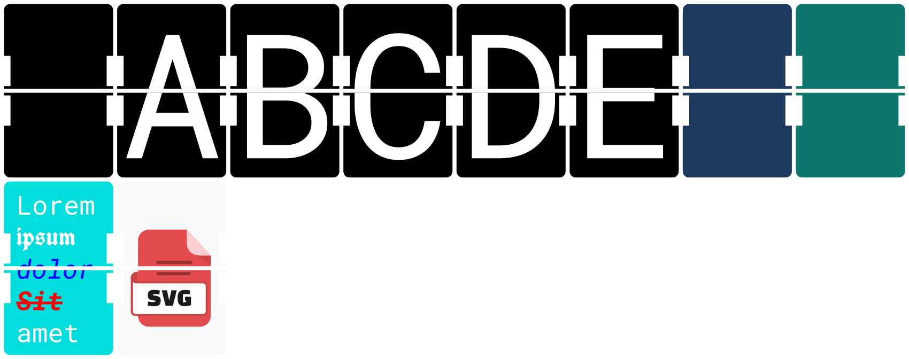
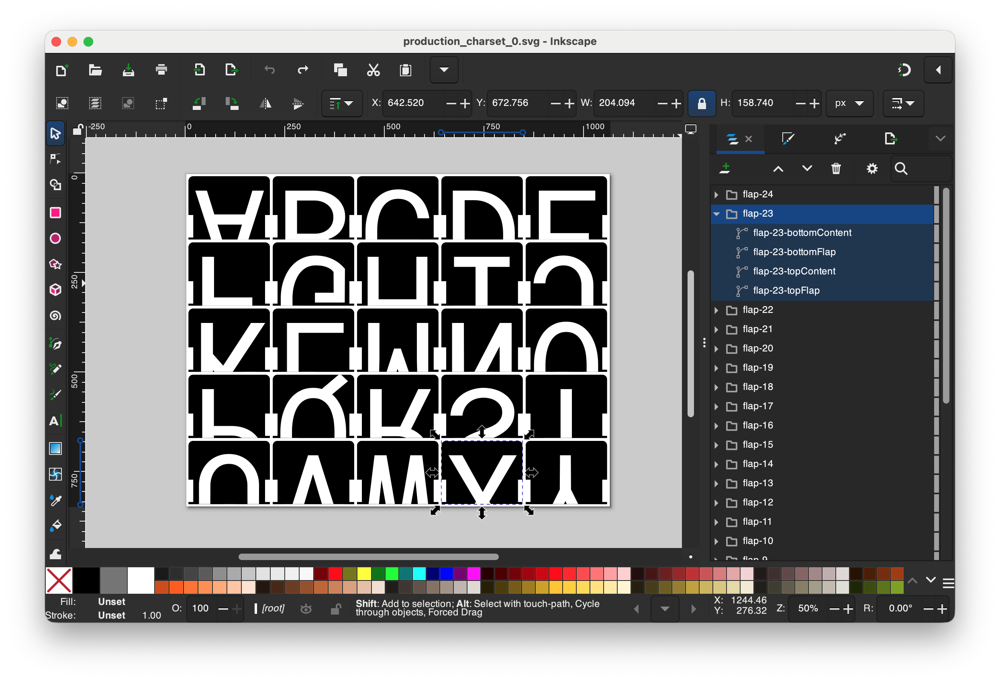
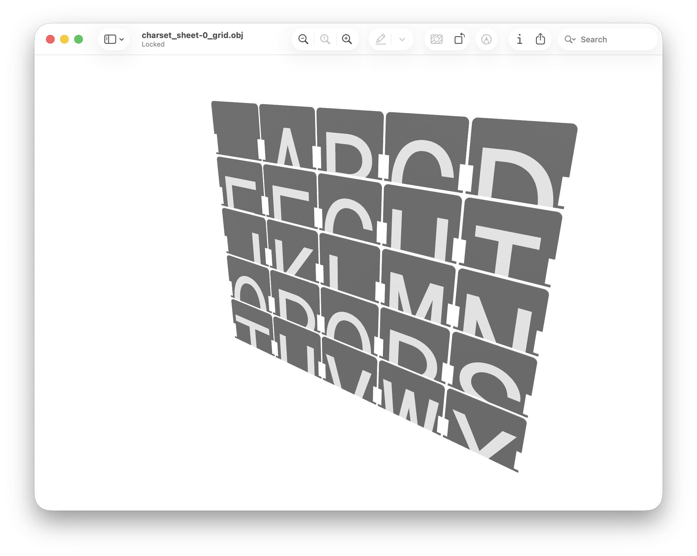

# split-flap-generator

Create split-flap module outputs from one data pipeline:

- SVG preview grids
- SVG production sheets
- OBJ/MTL meshes (per face or per sheet)

**Live demo:** [pileoni.github.io/split-flap-generator](https://pileoni.github.io/split-flap-generator/)

**npm:** [split-flap-generator](https://www.npmjs.com/package/split-flap-generator)  
**Source:** [github.com/piLeoni/split-flap-generator](https://github.com/piLeoni/split-flap-generator)



---

## Install

```bash
npm install split-flap-generator
```

---

## Quick start

```js
import { SplitFlap, generateFlapSvgTemplate } from "split-flap-generator";

const geometry = {
  width: 54,
  height: 86,
  flapCornerRadius: 3,
  flapsGap: 2,
  flangeHeight: 1.3,
  notchInset: 3.2,
  notchInnerHeight: 15,
};

const sf = new SplitFlap();
await sf.init({
  ...geometry,
  flapThickness: 0.75,
  embossDepth: 0.375,
});

for (const ch of " ABCDE") {
  await sf.createFLAP({ textContent: ch });
}

const previewSvg = sf.generateFlapsPreview({ cols: 8, gap: 2 });
const sheets2d = sf.generateProductionFlaps2D({ cols: 5, rows: 5, gap: 2 });
const sheets3d = sf.generateProductionFlaps3DGrid({ cols: 5, rows: 5, gap: 2, meshNamePrefix: "demo" });

const templateSvg = generateFlapSvgTemplate(geometry);
```

All outputs are returned as in-memory strings. File writing/export is up to your app.

---

## `createFLAP` input types

### Text

```ts
{ textContent: string, style?: FlapStyle }
```

### HTML (Satori element tree)

```ts
{ HTMLContent: SatoriElementNode, style?: FlapStyle }
```

`HTMLContent` is an element tree (`type`, `props`, `children`), not a raw HTML string.

### SVG

```ts
{ SVGContent: string, style?: FlapStyle }
```

`SVGContent` is a full SVG document string.

---

## Fonts

The renderer uses Satori and loads fonts from Google Fonts as needed.

- `init({ defaultFonts })` preloads known families.
- `createFLAP(...)` auto-loads extra families from flap style and nested HTML styles.
- Built-in fallback families: `Roboto Mono`, `Noto Sans`.
- In browser builds, Google CSS may return WOFF2-only entries; for predictable behavior, prefer pinned fonts or a CSS proxy strategy (see web demo source).

---

## 2D and 3D APIs

### 2D

- `generateFlapSvgTemplate(geometry)`
- `generateFlapsPreview({ cols, gap })`
- `generateProductionFlaps2D({ gap, cols?, rows? })`



### 3D

- `generateFlap3D(...)`
- `generateProductionFlaps3D(...)`
- `generateProductionFlaps3DGrid(...)`
- `generateProductionFlaps3DExport(...)`



---

## Examples

- `examples/node/run.tsx`: end-to-end Node pipeline (preview, production SVG sheets, OBJ/MTL)
- `examples/web/`: standalone Preact + Vite app (same core API)

Run Node example:

```bash
npm install
npm test
```

Run web demo locally:

```bash
npm install --prefix examples/web
npm run web:dev
```

---

## Repository layout

| Path | Purpose |
|---|---|
| `src/` | Library source |
| `examples/node/run.tsx` | Node demo |
| `examples/web/` | Web demo app |
| `examples/assets/` | Demo assets |
| `assets/readme/` | README images |

---

## Scripts

| Script | Description |
|---|---|
| `npm test` | Typecheck + Node demo run |
| `npm run build` | Build library `dist/` with tsup |
| `npm run dev` | Watch build |
| `npm run web:dev` | Start web demo |
| `npm run web:build` | Build web demo |

---

## License

[MIT](LICENSE)
